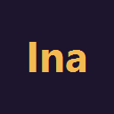
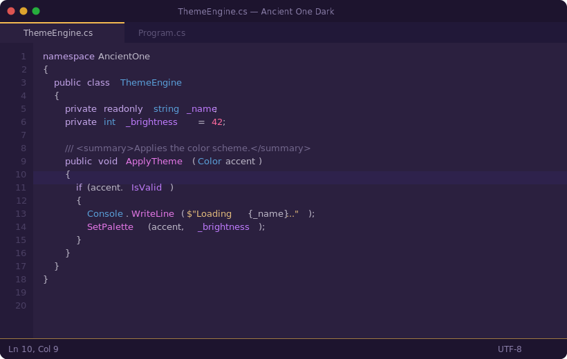
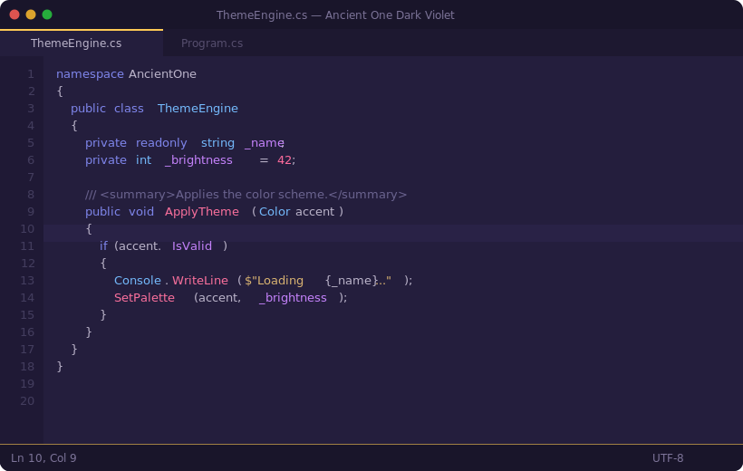
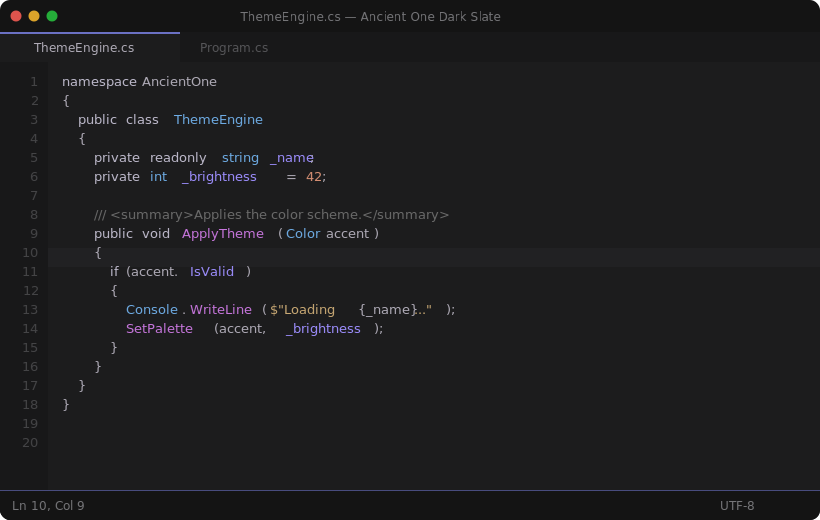

<div align="center">



# Ancient One Dark for Visual Studio

**Ninomae Ina'nis inspired color themes for Visual Studio 2022 / 2026**

[](https://github.com/BlackSiroGhost/InaVsTheme/releases/latest)
[](https://visualstudio.microsoft.com/)
[](LICENSE.txt)

*A faithful Visual Studio port of [Ancient One Dark](https://github.com/sigvt/ancient-one-dark) by [sigvt](https://github.com/sigvt)*

<br/>

</div>

<br/>

## Previews

### Dark

> Deep purple canvas, gold accents, warm syntax — the signature look.

<p align="center">

</p>

<details>
<summary>&nbsp;&nbsp;Color Palette</summary>
<br/>

| Role | Swatch | Hex |
|:-----|:------:|:----|
| Background |  | `#2B203F` |
| Foreground |  | `#C0BBCB` |
| Keyword |  | `#C7A8ED` |
| String |  | `#E6BE7D` |
| Number |  | `#FC6A9D` |
| Type / Class |  | `#5AA1DB` |
| Method |  | `#E678E8` |
| Field / Property |  | `#C07CFF` |
| Comment |  | `#73688D` |
| Accent |  | `#F4BA51` |
| Shell |  | `#1D142E` |

</details>

<br/>

### Violet

> Deeper indigo-purple, cool blue keywords, warm golden strings.

<p align="center">

</p>

<details>
<summary>&nbsp;&nbsp;Color Palette</summary>
<br/>

| Role | Swatch | Hex |
|:-----|:------:|:----|
| Background |  | `#241E3D` |
| Foreground |  | `#BDB6CC` |
| Keyword |  | `#8087EE` |
| String |  | `#DDB672` |
| Number |  | `#FF6B9D` |
| Type / Class |  | `#75BCFF` |
| Method |  | `#FE719E` |
| Parameter |  | `#C884FF` |
| Comment |  | `#6B6490` |
| Accent |  | `#FDC955` |
| Shell |  | `#19152A` |

</details>

<br/>

### Slate

> Neutral dark base, muted tones, subtle indigo accents — easy on the eyes.

<p align="center">

</p>

<details>
<summary>&nbsp;&nbsp;Color Palette</summary>
<br/>

| Role | Swatch | Hex |
|:-----|:------:|:----|
| Background |  | `#1C1C1D` |
| Foreground |  | `#B0ACB8` |
| Keyword |  | `#BFBBCD` |
| String |  | `#C9A974` |
| Number |  | `#D48E72` |
| Type / Class |  | `#6EACE5` |
| Method |  | `#C776DD` |
| Field / Property |  | `#9D8EFF` |
| Comment |  | `#6A6A6A` |
| Accent |  | `#6B71C4` |
| Shell |  | `#141414` |

</details>

<br/>

---

## Features

- **Full shell theming** — title bar, tool windows, menus, tabs, scrollbars, sticky scroll, solution badge
- **Complete syntax highlighting** — Roslyn, Language Service, Text Manager, and ReSharper override categories
- **Modern VS 2022 UI** — Shell & ShellInternal WinUI tokens for newer VS 2022 UI elements
- **In-app switching** — change themes from **Extensions > Ancient One** without restarting
- **VS 2022 & 2026** — separate VSIX for each version

## Installation

### From Release

Download the correct `.vsix` for your Visual Studio version from [**Releases**](https://github.com/BlackSiroGhost/InaVsTheme/releases/latest):

| File | Visual Studio Version |
|------|-----------------------|
| `InaVsTheme.vsix` | **VS 2026** (18.x) |
| `InaVsTheme-VS2022.vsix` | **VS 2022** (17.9+) |

1. Download **only** the `.vsix` matching your Visual Studio version
2. Double-click the `.vsix` to open the installer
3. **Only check the matching Visual Studio version** — uncheck any others
4. Restart Visual Studio
5. Switch themes via **Extensions > Ancient One** or **Tools > Theme**

> **Note:** The VSIX installer may show checkboxes for all installed Visual Studio versions.
> The version constraint will block installation on incompatible versions, but to avoid confusion,
> only select the version that matches the file you downloaded.

### From Source

Requires Visual Studio 2022/2026 with the **Visual Studio extension development** workload.

```
build.cmd
```

Output:
- VS 2026: `src\bin\Release\InaVsTheme.vsix`
- VS 2022: `vs22\bin\Release\InaVsTheme-VS2022.vsix`

---

## Credits

| | |
|:---:|:---|
| [**Ancient One Dark**](https://github.com/sigvt/ancient-one-dark) | The original VS Code theme by [**sigvt**](https://github.com/sigvt). All color palettes originate from their work. |
| [**VantaBlack**](https://github.com/madskristensen/VantaBlack) | Extension structure inspired by [Mads Kristensen](https://github.com/madskristensen)'s VS theme. |

> This is an **unofficial community port**. The color schemes belong to their respective creators.
> If you enjoy the palette, please star the [original repo](https://github.com/sigvt/ancient-one-dark).

## License

[MIT](LICENSE.txt) — Copyright (c) 2026 BlackSiroGhost
